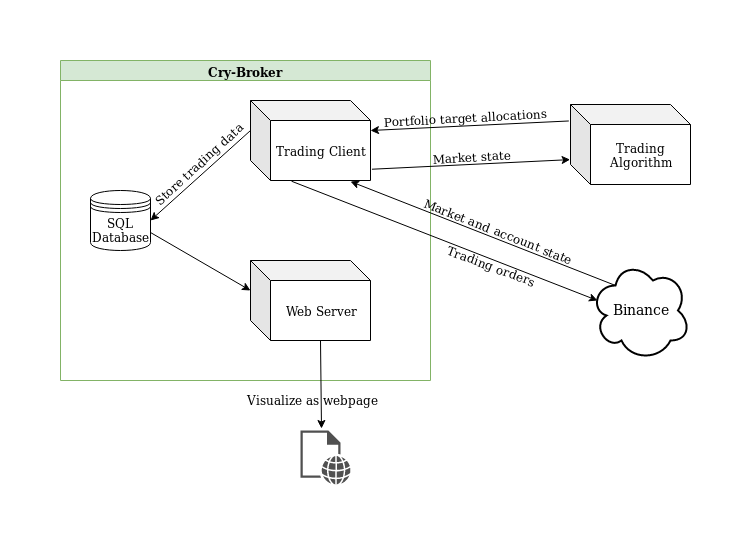
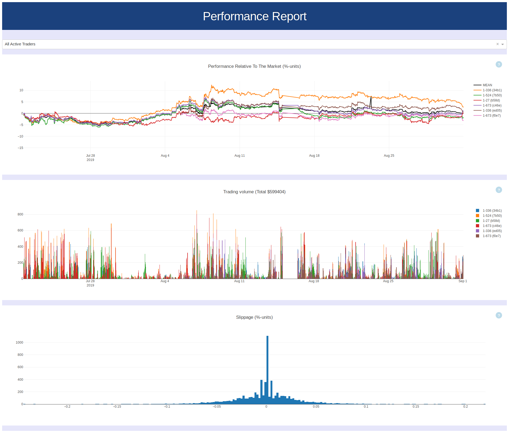

# Cry-Broker

Serves as an interface between cryptocurrency exchange ([Binance](https://www.binance.com)) and a trading algorithm. I.e. allows portfolio manager algorithm to have its trades executed on a real exchange.

Features

* Automated 24/7 buying and selling of assets based on algorithm's predictions.
* Collects trading and market data to a SQL database.
* Performance visualization as a webpage for easy telemonitoring (see fig 2).
* Multiple traders possible by starting one program instance for each.
* Error communication via Telegram.
* Direct exchange of assets minimizes paid fees. For example, BTC can be converted directly to BNB without intermediate conversion step to cash (USDT).
* Light enough to run 6 instances with Tensorflow backed algorithms and a webserver on a Raspberry Pi 3.

Fig 1: Architecture.

---

Fig 2: Performance report webpage (50 days of trading).
